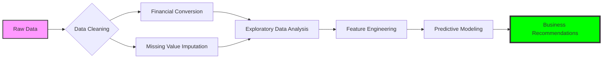
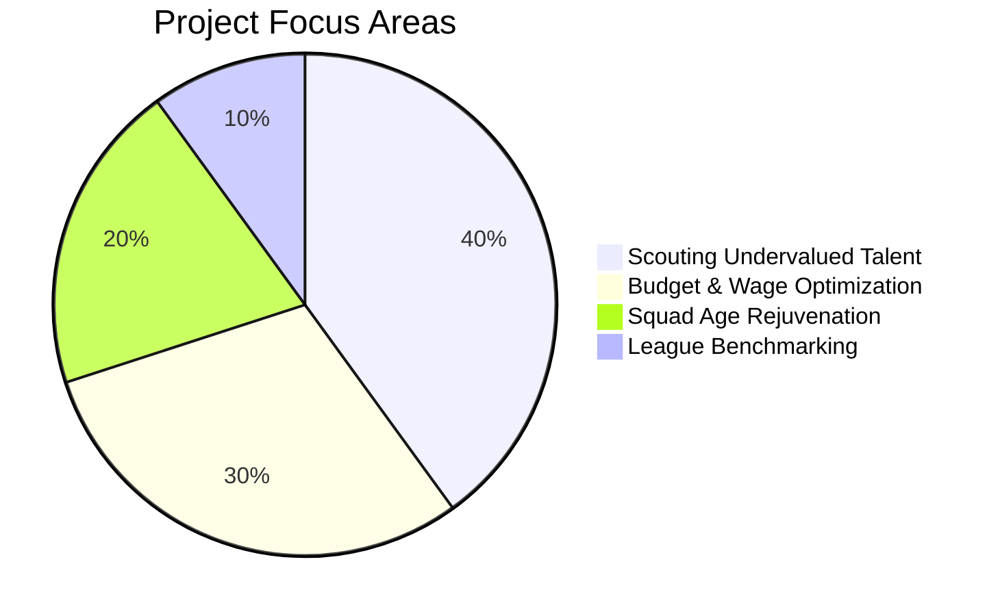

# ⚽ FIFA 19: Advanced Exploratory Data Analysis


> **"Unlocking the financial and performance patterns of 18,000+ world-class athletes."**

---

## 🗺️ Project Roadmap
To achieve high-quality business insights, this project follows a structured data science pipeline:



---

## 🎯 Business Strategic Framework
Our analysis focuses on four critical pillars of football club management:



---

## ⚡ Key Features & Insights

### 💎 The "Superstar" Threshold
*   **Insight**: Once a player crosses an **80 Overall Rating**, their market value increases at an **exponential rate**.
*   **Business Impact**: Clubs must identify players at the 78-79 rating mark to secure them before their value triples.

### ⏳ The Peak Age Window
*   **Discovery**: The most cost-effective and high-performing age bracket is **21-26 years old**.
*   **Strategy**: Invest in players within this window to maximize both on-field performance and future resale value.

### 📈 Growth Potential (The Potential Gap)
*   **Metric**: `Potential - Overall = Potential Gap`
*   **Utility**: This metric highlights "hidden gems"—young players who are far from their ceiling and represent high ROI.

---

## 🛠️ Technical Implementation

| Component | Technology | Purpose |
| :--- | :--- | :--- |
| **Backend** | Python 3.x | Core Logic |
| **Data Ops** | Pandas / NumPy | Wrangling & Math |
| **Visuals** | Seaborn / Matplotlib | Storytelling |
| **ML Baseline** | Scikit-Learn | Value Prediction |

---

## 🚀 Getting Started

1.  **Environment Setup**:
    ```bash
    pip install -r requirements.txt # pandas, numpy, seaborn, scikit-learn
    ```
2.  **Dataset**: Ensure `fifa_eda.csv` is in the root directory.
3.  **Execute**: Open `harsh_project (1).ipynb` and run all cells.

---

## 👨‍💻 Project Metadata
- **Lead Researcher**: Harsh Kumar
- **Affiliation**: Section D2512 | Roll No: 09
- **Project ID**: FIFA-EDA-2024-001

---
